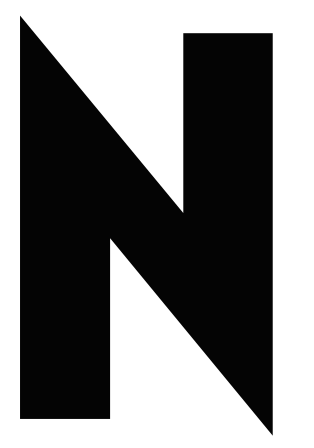

# Neptura Science - Logo Specifications & Usage Guide

## 📋 Logo System Overview

The Neptura Science logo system consists of two primary elements:
- **Icon Mark (N)** - Primary symbol for compact applications
- **Wordmark (NEPTURA)** - Primary wordmark for full branding

Both elements are available in multiple color variations for different contexts.

---

## 🎨 Icon Mark (N) - Specifications

### Base File
- **File:** `neptura-icon-base.svg`
- **Format:** SVG (Scalable Vector Graphics)
- **Dimensions:** 256x256px (viewBox)
- **Stroke:** Geometric design, solid fill
- **Transparency:** Full alpha channel support

### Color Variations

| Variant | File | Color | Hex | Usage |
|---------|------|-------|-----|-------|
| White | `neptura-icon-white.svg` | White | #FFFFFF | Dark backgrounds, dark UI |
| Black | `neptura-icon-black.svg` | Black | #000000 | Light backgrounds, light UI |
| Neptura Blue | `neptura-icon-neptura-blue.svg` | Blue | #3B82F6 | Primary branding, data visualization |
| Signal Green | `neptura-icon-signal-green.svg` | Green | #10B981 | Success states, CTAs |
| Alert Orange | `neptura-icon-alert-orange.svg` | Orange | #F59E0B | Warnings, alerts |

### Sizing Guidelines

| Context | Minimum | Recommended | Maximum |
|---------|---------|-------------|---------|
| Favicon | 16px | 32px | 64px |
| App Icon | 32px | 64-128px | 256px |
| UI Button | 24px | 32-48px | 64px |
| Header Logo | 32px | 64px | 128px |
| Large Signage | 128px | 256px+ | Unlimited |

### Usage Rules

✓ **DO:**
- Use on solid backgrounds (dark or light)
- Scale proportionally (maintain aspect ratio)
- Use appropriate color for contrast
- Maintain minimum sizing guidelines

✗ **DON'T:**
- Rotate or skew the icon
- Change the aspect ratio
- Add effects or shadows
- Combine with wordmark (use separately)
- Use on patterned backgrounds without contrast

---

## 📝 Wordmark (NEPTURA) - Specifications

### Base File
- **File:** `neptura-wordmark-base.svg`
- **Format:** SVG (Scalable Vector Graphics)
- **Font:** Linotype Spitz Medium
- **Text:** "NEPTURA"
- **Transparency:** Full alpha channel support

### Color Variations

| Variant | File | Color | Hex | Usage |
|---------|------|-------|-----|-------|
| Black | `neptura-wordmark-black.svg` | Black | #000000 | Primary, light backgrounds |
| White | `neptura-wordmark-white.svg` | White | #FFFFFF | Dark backgrounds |
| Neptura Blue | `neptura-wordmark-neptura-blue.svg` | Blue | #3B82F6 | Accent branding |
| Signal Green | `neptura-wordmark-signal-green.svg` | Green | #10B981 | Success emphasis |
| Alert Orange | `neptura-wordmark-alert-orange.svg` | Orange | #F59E0B | Warning emphasis |

### Sizing Guidelines

| Context | Minimum | Recommended | Maximum |
|---------|---------|-------------|---------|
| Web Header | 120px | 200px | 400px |
| Presentation Slide | 150px | 250px | 500px |
| Print Material | 200px | 300px | Unlimited |
| Signage | 300px | 500px+ | Unlimited |
| Small UI | 80px | 120px | 200px |

### Usage Rules

✓ **DO:**
- Use on contrasting backgrounds
- Scale proportionally
- Use appropriate color for readability
- Maintain minimum sizing guidelines
- Use as primary brand identifier

✗ **DON'T:**
- Rotate or skew the wordmark
- Change letter spacing
- Add effects or shadows
- Combine with icon (use separately)
- Use on backgrounds with poor contrast

---

## 🎯 Logo Combinations & Layouts

### Layout 1: Icon + Wordmark (Horizontal)
- **Use when:** Full branding needed, horizontal space available
- **Spacing:** 16px gap between icon and wordmark
- **Alignment:** Vertical center
- **Minimum width:** 300px

### Layout 2: Icon Only
- **Use when:** Limited space, compact applications
- **Contexts:** Favicon, app icon, button, badge
- **Sizing:** 16px - 256px

### Layout 3: Wordmark Only
- **Use when:** Full brand identity needed
- **Contexts:** Website header, presentations, marketing materials
- **Sizing:** 120px - unlimited

### Layout 4: Stacked (Icon over Wordmark)
- **Use when:** Vertical space available
- **Spacing:** 12px gap between icon and wordmark
- **Alignment:** Horizontal center
- **Minimum height:** 250px

---

## 🌈 Color Application Rules

### Dark Background (#0B0E14)
- **Icon:** Use White or Neptura Blue
- **Wordmark:** Use White or Neptura Blue
- **Contrast Ratio:** 21:1 (WCAG AAA)

### Light Background (#FFFFFF)
- **Icon:** Use Black or Neptura Blue
- **Wordmark:** Use Black or Neptura Blue
- **Contrast Ratio:** 21:1 (WCAG AAA)

### Colored Backgrounds
- **Icon:** Use White or Black (for contrast)
- **Wordmark:** Use White or Black (for contrast)
- **Contrast Ratio:** Minimum 4.5:1 (WCAG AA)

### Data Visualization
- **Icon:** Use Neptura Blue, Signal Green, or Alert Orange
- **Wordmark:** Use Neptura Blue
- **Context:** Charts, dashboards, metrics

---

## 📦 File Organization

```
neptura-brand-resources/
├── logos/
│   ├── neptura-icon-base.svg
│   ├── neptura-wordmark-base.svg
│   └── variants/
│       ├── neptura-icon-white.svg
│       ├── neptura-icon-black.svg
│       ├── neptura-icon-neptura-blue.svg
│       ├── neptura-icon-signal-green.svg
│       ├── neptura-icon-alert-orange.svg
│       ├── neptura-wordmark-white.svg
│       ├── neptura-wordmark-black.svg
│       ├── neptura-wordmark-neptura-blue.svg
│       ├── neptura-wordmark-signal-green.svg
│       └── neptura-wordmark-alert-orange.svg
├── colors/
│   ├── neptura-colors.json
│   └── neptura-colors.css
├── typography/
│   └── neptura-typography.json
├── LOGO_SPECIFICATIONS.md (this file)
├── README.md
└── LICENSE.txt
```

---

## 🚀 Implementation Examples

### Web - HTML/CSS
```html
<!-- Icon in header -->


<!-- Wordmark in footer -->

```

### React/Vue Component
```jsx

```

### Figma/Design Tools
1. Import base SVG: `neptura-icon-base.svg`
2. Create component with color variants
3. Use variants for different contexts
4. Maintain 1:1 aspect ratio

### Print Materials
1. Use highest resolution variant (SVG scales infinitely)
2. Ensure minimum sizing: 200px for wordmark, 100px for icon
3. Verify color accuracy with Pantone/CMYK conversion
4. Test contrast on final background

---

## ✅ Quality Checklist

Before using logos in any material:

- [ ] Correct color variant selected for background
- [ ] Minimum sizing guidelines met
- [ ] Aspect ratio maintained (no stretching)
- [ ] Contrast ratio meets WCAG AA minimum (4.5:1)
- [ ] File format appropriate for medium (SVG for web, PNG for print)
- [ ] Logo not rotated or skewed
- [ ] Icon and wordmark not combined (used separately)
- [ ] Sufficient whitespace around logo
- [ ] Logo not placed on patterned backgrounds
- [ ] File naming convention followed

---

## 📞 Support & Questions

For questions about logo usage, specifications, or brand guidelines:
- Email: hello@neptura.science
- Website: neptura.science
- Brand Guidelines: See README.md

---

**Neptura Science** - The Climate Certainty Engine
From doubt to investment in 15 days.

*Last Updated: January 21, 2026*
